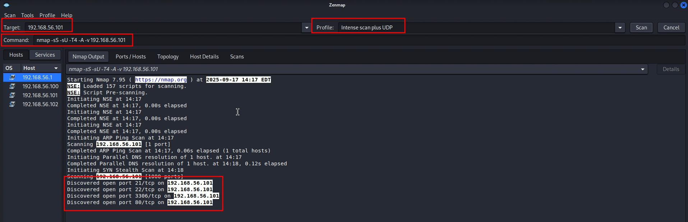
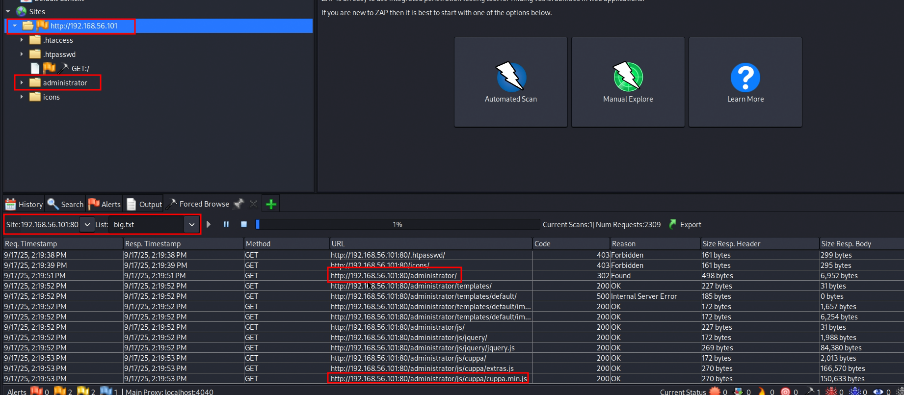
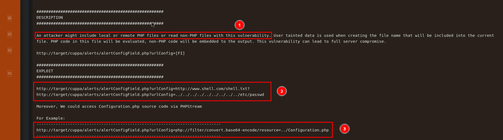

# Alpha Attack — Cuppa CMS LFI

 [](#)

> **A professional, reproducible pentest lab demonstrating a full attack chain** against a vulnerable Cuppa CMS instance: Recon → Web Enumeration → LFI Exploitation → Credential Recovery → Privilege Escalation → Remediation.

---

## Table of Contents

- [Overview](#overview)
    
- [Demo / Preview](#demo--preview)
    
- [Scope & Lab Environment](#scope--lab-environment)
    
- [Executive Summary (Attack Chain)](#executive-summary-attack-chain)
    
- [Detailed Walkthrough](#detailed-walkthrough)
    
    - [Network Reconnaissance](#network-reconnaissance)
        
    - [Web Enumeration](#web-enumeration)
        
    - [Identifying Cuppa & LFI](#identifying-cuppa--lfi)
        
    - [Exploitation — LFI Request](#exploitation--lfi-request)
        
    - [Password Cracking](#password-cracking)
        
    - [Initial Access & Privilege Escalation](#initial-access--privilege-escalation)
        
- [Screenshots](#screenshots)
    
- [Presentation Deck](#presentation-deck)
    
- [Repository Structure & Deliverables](#repository-structure--deliverables)
    
- [Tools Used](#tools-used)
    
- [Security Findings & Recommendations](#security-findings--recommendations)
    
- [Responsible Disclosure & Ethics](#responsible-disclosure--ethics)
    
- [Contributing](#contributing)
    
- [License](#license)
    
- [Contact](#contact)
    

---

## Overview

**Alpha Attack** is an educational penetration testing exercise that reproduces a realistic attacker workflow against a purposely vulnerable Cuppa CMS instance in an isolated lab. The repository contains a clean, step-by-step writeup, reusable commands, artifacts (scans, Zap sessions, potfiles), screenshots for each major step, and a polished slide deck for presentations.

This project is intended for defensive learning, curriculum material, and awareness — not for malicious activity.

---

## Demo / Preview

> Place three representative screenshots per section under `/screenshots` and they will render in this README using GitHub relative links.

**Example preview (replace with actual images):**

  

---

## Scope & Lab Environment

- **Target:** Cuppa CMS VM at `192.168.56.101`.
    
- **Network:** Isolated lab (192.168.56.0/24). **Do not** run these techniques on production or third-party systems.
    
- **Goal:** Demonstrate a complete kill-chain for learning and remediation.
    

---

## Executive Summary (Attack Chain)

**High-level steps:**

1. **Reconnaissance** – Identify live hosts and open services.
    
2. **Web Enumeration** – Discover web application endpoints and admin interface.
    
3. **Exploitation** – Trigger a Local File Inclusion (LFI) to read sensitive files.
    
4. **Credential Recovery** – Extract and crack password hashes offline.
    
5. **Initial Access & Privilege Escalation** – SSH access with recovered credentials and escalate to root.
    
6. **Remediation** – Code fixes, credential hardening, and least-privilege enforcement.
    

---

## Detailed Walkthrough

> Each subsection below includes recommended commands and three annotated screenshots. See `writeup/full_writeup.md` for the full play-by-play, including exact commands, payloads, and logs.

### Network Reconnaissance

**What we did:**

- Identified host network interfaces using `ip addr`.
    
- Ran Zenmap / nmap scans: ping sweep, `-A -sC -sV` and UDP probes to enumerate services.
    

**Key findings:** FTP(21), SSH(22), HTTP(80), MySQL(3306).

**Commands:**

```bash
# ping sweep (example)
nmap -sn 192.168.56.0/24
# aggressive service detection
nmap -A -sV -p- 192.168.56.101
```

**Screenshots:** `screenshots/recon-1.png`, `screenshots/recon-2.png`, `screenshots/recon-3.png`

---

### Web Enumeration

**What we did:**

- Configured FoxyProxy to route browser traffic into ZAP.
    
- Performed forced-browse (wordlist `big.txt`) and manual inspection.
    
- Located admin paths and interesting parameters.
    

**Screenshots:** `screenshots/webenum-1.png`, `screenshots/webenum-2.png`, `screenshots/webenum-3.png`

---

### Identifying Cuppa & LFI

**What we found:**

- `/administrator/` indicated a Cuppa CMS installation.
    
- `alertConfigField.php` accepted a `urlConfig` parameter vulnerable to Local File Inclusion (LFI).
    

**Why it matters:** LFI allows an attacker to read arbitrary files on the filesystem, often leading to credential disclosure.

**Screenshots:** `screenshots/lfi-1.png`, `screenshots/lfi-2.png`, `screenshots/lfi-3.png`

---

### Exploitation — LFI Request

**Payload pattern:**

```
/alertConfigField.php?urlConfig=../../../../../../../etc/passwd
```

**Process:** Send crafted requests through ZAP, edit requests in the Request Editor (GET ⇄ POST), and extract file contents for offline analysis.

**Screenshots:** `screenshots/exploit-1.png`, `screenshots/exploit-2.png`, `screenshots/exploit-3.png`

---

### Password Cracking

**What we did:**

- Extracted `w1r3s` hash from `/etc/shadow` and created `unshadow.txt`.
    
- Used John the Ripper with `rockyou.txt`.
    

**Commands:**

```bash
john --format=sha512crypt --wordlist=rockyou.txt unshadow.txt
john --show unshadow.txt
```

**Result:** Recovered password `computer` — evidence of weak password policy.

**Screenshots:** `screenshots/john-1.png`, `screenshots/john-2.png`, `screenshots/john-3.png`

---

### Initial Access & Privilege Escalation

**Steps:**

- `ssh w1r3s@192.168.56.101` using recovered password.
    
- Checked `sudo -l` → user had unrestricted sudo rights.
    
- `sudo -i` → root shell → `cat /root/flag.txt`.
    

**Screenshots:** `screenshots/priv-1.png`, `screenshots/priv-2.png`, `screenshots/priv-3.png`

---

## Screenshots

Store screenshots in `/screenshots` (3 per section). Recommended filenames are used throughout this README so they render automatically on GitHub.

**Tip:** Redact or blur any sensitive hostnames or personal data before publishing.

---

## Presentation Deck

Polished slide decks are included in `/presentation` in both PDF and PPTX formats for easy sharing and live demos.

Files:

- `presentation/AlphaAttack_presentation.pdf`
    
- `presentation/AlphaAttack_presentation.pptx`
    

---

## Repository Structure & Deliverables

```
AlphaAttack-Cuppa-LFI/
├─ README.md
├─ LICENSE
├─ presentation/
│  ├─ AlphaAttack_presentation.pdf
│  └─ AlphaAttack_presentation.pptx
├─ screenshots/
│  ├── 4.1.png
│  ├── 4.2.png
│  ├── 4.3.png
│  ├── 5.1.png
│  ├── 5.2.png
│  ├── 5.3.png
│  ├── 5.4.png
│  ├── 6.1.png
│  ├── 6.2.png
│  ├── 6.3.png
│  ├── 7.1.png
│  ├── 7.2.png
│  ├── 7.3.png
│  ├── 7.4.png
│  ├── 7.5.png
│  ├── 8.1.png
│  ├── 8.2.png
│  ├── 9.1.png
│  ├── 9.2.png
│  └── 9.3.png
├─ writeup/
│  ├─ full_writeup.md
│  └─ commands_and_notes.md
├─ tools.md
├─ outputs/
├─ ├─ nmap/
├─ │ ├─ initial_scan.nmap
├─ │ ├─ initial_scan.xml
├─ │ └─ ping_sweep.gnmap
├─ ├─ zap/
├─ │ └─ session.session
├─ ├─ exfiltrated/
├─ │ ├─ etc_passwd.txt
├─ │ └─ etc_shadow.txt
└─ ├─ john/
     ├─ unshadow.txt
     ├─ john.pot
     └─ john-show.txt
```

---

## Tools Used

- Zenmap / nmap
    
- ZAP (Zed Attack Proxy)
    
- FoxyProxy
    
- John the Ripper
    
- SSH / standard Linux tooling (cat, sudo, ipaddr)
    

---

## Security Findings & Recommendations

**Findings:**

- LFI in `alertConfigField.php`.
    
- Poor credential hygiene (weak password).
    
- Over-privileged user with full sudo access.
    

**Recommendations:**

1. Fix input sanitization & remove direct file inclusion patterns.
    
2. Enforce strong password policy and MFA for admin accounts.
    
3. Apply least-privilege principles for all accounts and services.
    
4. Harden exposed services and enable centralized logging and monitoring.
    

---

## Responsible Disclosure & Ethics

This work was conducted in an isolated lab for educational purposes only. Do not use this material to attack systems without explicit authorization. If you discover vulnerabilities in third-party systems, follow responsible disclosure practices.

---

## Contributing

Contributions are welcome. Please open issues or pull requests for corrections, additional notes, or better remediation strategies. Before submitting: ensure no sensitive data (passwords, keys, hostnames) are included in your changes.

---

## License

This repository is distributed under the **MIT License** — see `LICENSE` for details.


